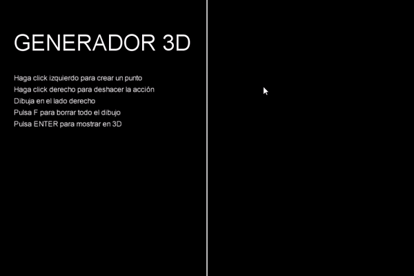

# CIU_Practica2
## Creando figuras en 3D - Ismael Aarab Umpiérrez

### Introducción
- Crear un prototipo que recoja puntos de un perfil del sólido de revolución al hacer clic con el ratón sobre la pantalla. Dicho perfil será utilizado por el prototipo para para crear un objeto tridimensional por medio de una superficie de revolución, almacenando la geometría resultante en una variable de tipo PShape. El prototipo permitirá crear sólidos de revolución de forma sucesiva, si bien únicamente se asumirá necesario almacenar el último definido.

### Instrucciones
- Modo 2D: Este modo permite al usuario crear ciertos puntos en la gráfica en los que se irá uniendo a medida que se creen más de estos, y, más adelante, se podrá crear una figura 3D en base a ello.
  - **Click izquierdo** - Crea un punto en el programa.
  - **Click derecho** - Deshace la última acción realizada.
  - **F** - Borra el dibujo entero.
  - **ENTER** - genera la figura en 3D.
- Modo 3D: este modo se habilita después de haber creado los puntos en la gráfica en modo 2D y genera una figura en 3D.
  - **F** - Borra el dibujo entero.
  - **W** - Mueve la figura hacia arriba.
  - **S** - Mueve la figura hacia abajo.
  - **A** - Mueve la figura hacia la izquierda.
  - **D** - Mueve la figura hacia la derecha.
  
  ### Herramientas y Referencias
  
  - [Conversión video a GIF](https://ezgif.com/video-to-gif)
  
  - [Daniel Shiffman. PShape tutorial](https://processing.org/tutorials/pshape/.)
